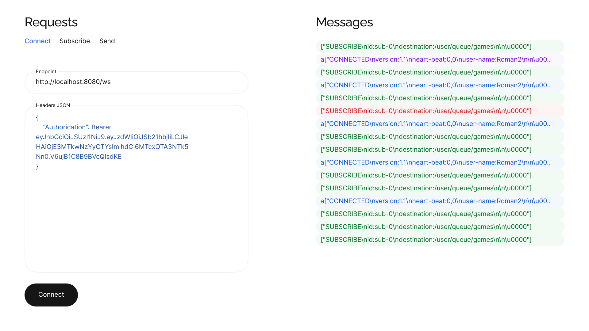
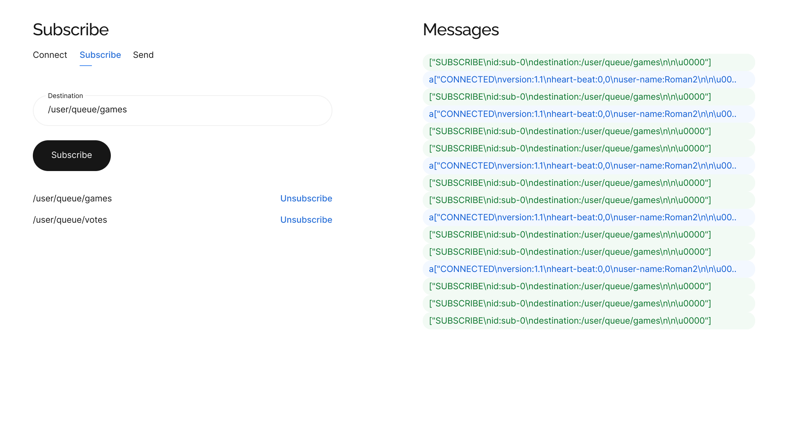
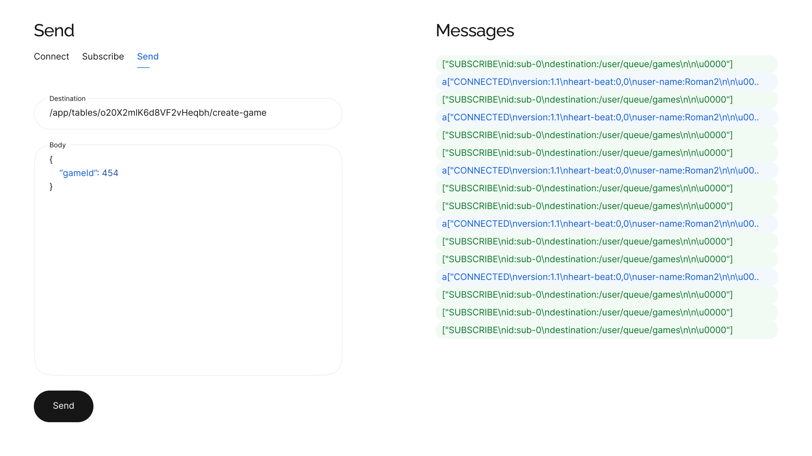

# Showdown

ShoeJS is a React application for testing STOMP websockets using SockJS.

<p align="center">
  
</p>
<p align="center">
  
</p>
<p align="center">
  
</p>

# Running locally
1. Go to the project directory
2. Run these commands in the console
    ```bash
    npm install
    npm run dev
    ```